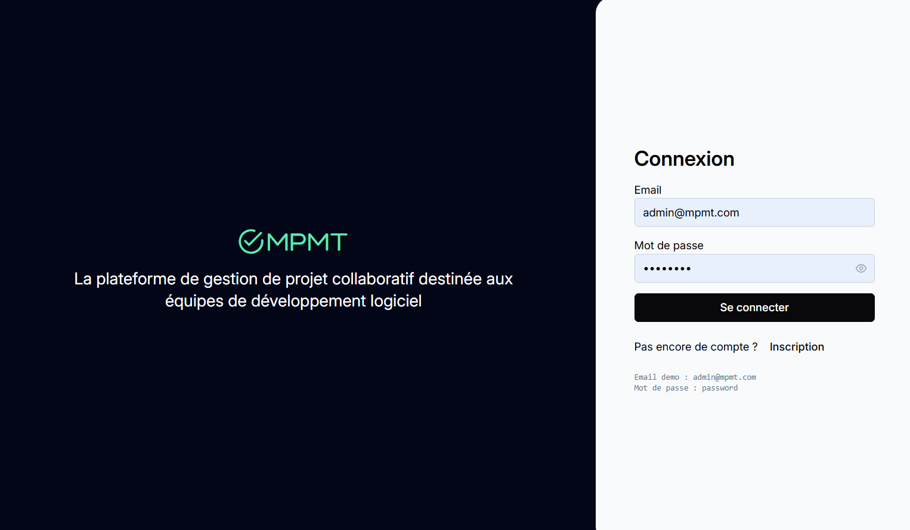
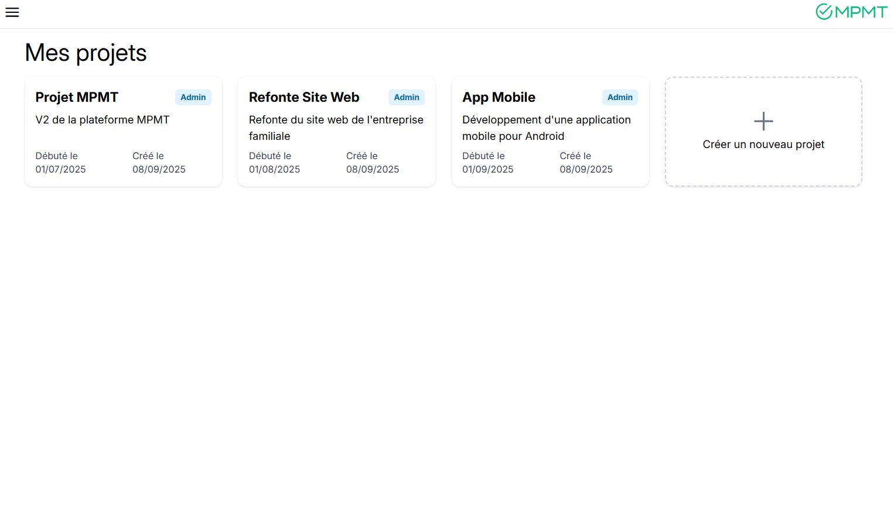
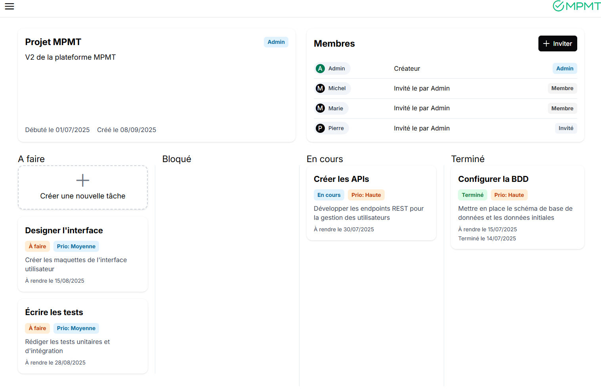
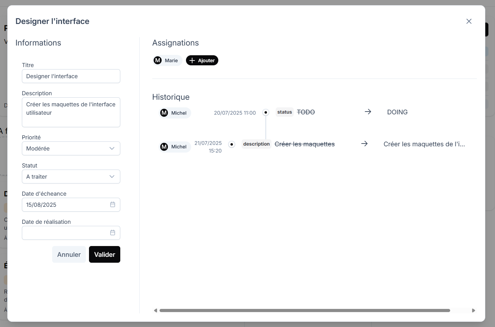

# MPMT - Application de Gestion de Projet - Franck Calcari


# A l'attention du correcteur

## Installation et vérification du projet

<br>
1. Copiez le repo

```
git clone https://github.com/calcari/mpmt.git
cd mpmt
```

<br>
2. Obtenez les images depuis le docker registry (de github) et lancez les (tout est automatique grace au fichier docker-compose.prod.yml)

```
docker compose -f docker-compose.prod.yml up
```
<br>
3. L'application est disponible :

- Frontend : http://localhost:8055
- Backend : http://localhost:8066
- DB : http://localhost:8077


## Captures d'écran (non exhaustif)
#### Connexion


#### Liste des projets / ajout de projet


#### Détail projet, dashboard des taches, invitations


#### Détails et edition tache, assignations, historique



# Reports test et coverage
[Voir dans livrables-etude-de-cas/reports/](./livrables-etude-de-cas/reports/)

# Scripts de base de donnée
Un export de la base postgres de demo est disponible dans [database_dump.sql](./livrables-etude-de-cas/database_dump.sql)
Ca n'a pas grand intérêt car Spring génère automatiquement les tables (LDD) et les données de tests sont automatiquement ajoutées. 

# Readme documentation
👉 Voir [le vrai readme](./usage.md) pour les commandes de base.
